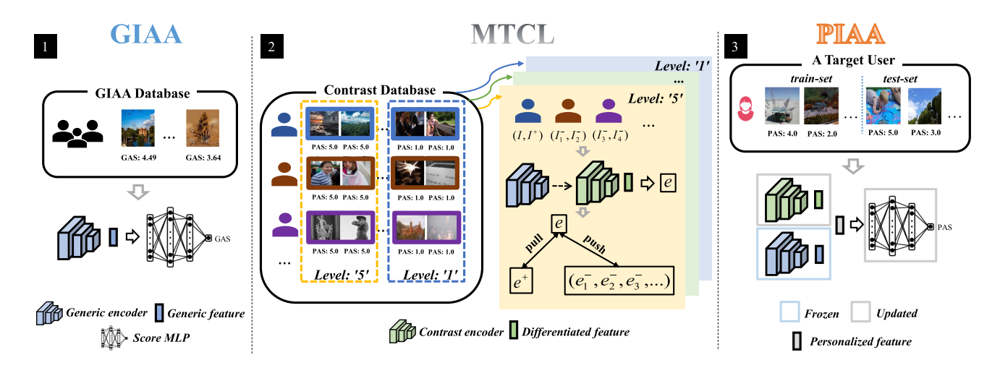

<h1 align="center">Multi-Level Transitional Contrast Learning for Personalized Image Aesthetics Assessment</h1>

<div align="center">
    <a href="https://github.com/yzc-ippl/" target="_blank">Zhichao Yang</a><sup>1</sup>,
    <a href="https://web.xidian.edu.cn/ldli/" target="_blank">Leida Li</a><sup>1*</sup>,
    <a href="#" target="_blank">Yuzhe Yang</a><sup>2</sup>,
    <a href="#" target="_blank">Yaqian Li</a><sup>2</sup>,
    <a href="#" target="_blank">Weisi Lin</a><sup>3</sup>,
</div>

<div align="center">
  <sup>1</sup>School of Artificial Intelligence, Xidian University
  <br>
  <sup>2</sup>OPPO Research Institute,
  <sup>3</sup> School of Computer Science and Engineering, Nanyang Technological University
</div>

<div align="center">
<sup>*</sup>Corresponding author
</div>

<div align="center">
  
</div>


## Introduction： 
### PyTorch implementation for the [paper](https://ieeexplore.ieee.org/abstract/document/10168279)  

### Model weight：[./model](https://pan.baidu.com/s/1wsb249NwjgaoPCBlHNRM1Q?pwd=0981)

## Inference Guide：

### 1. Overview
This guide will help you get started with the MTCL inference code.

### 2. Model Architecture

MTCL consists of three main components:
```
**GIAA Model**: General Image Aesthetic Assessment backbone (ResNet-50 based)
**Contrast Model**: Contrastive learning encoder for personalized features
**PIAA Model**: Fusion of GIAA and Contrast features with personalized regression head
```

### 3. Directory Structure
```
project_root/
├── code/
│   ├── GIAA/
│   │   └── train_GIAA_model.py       # GIAA model definition
│   ├── MTCL/
│   │   └── Contrast_Database         # Contrast data for training
│   │   └── FlickrAES_TrainUser       # Train user of FlickrAES
│   │   └── train_Contrast_model.py   # Contrast model definition
│   └── PIAA/
│       └── ├── FlickrAES_PIAA/
            │       └── image/        # Flickr-AES images
            │       └── label/
            │           ├── test_worker.csv                   # Test Worker information
            │           └── image_labeled_by_each_worker.csv  # Image ratings by workers

            └── test_PIAA_model.py          # This inference script
```

### 4. Download Model Weight
Pre-trained PIAA Model: Place at 
```
./model/ResNet50/ResNet50-FlickrAes-PIAA.pt
./model/ResNext101/ResNext101-FlickrAes-PIAA.pt
```
Flickr-AES Dataset:  
```
Images: ./FlickerAes_PIAA/image/
Labels: ./FlickerAes_PIAA/label/
```

### 5. Running Inference
```
python test_PIAA_model.py
```

## Citation
If you find our work is useful, pleaes cite the paper: 
```bibtex
@article{yang2023multi,
  title={Multi-level transitional contrast learning for personalized image aesthetics assessment},
  author={Yang, Zhichao and Li, Leida and Yang, Yuzhe and Li, Yaqian and Lin, Weisi},
  journal={IEEE Transactions on Multimedia},
  volume={26},
  pages={1944--1956},
  year={2023},
  publisher={IEEE}
}
```
